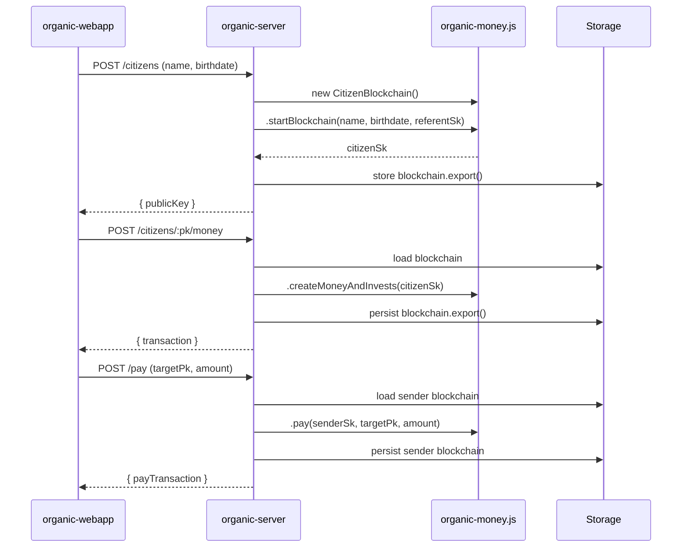
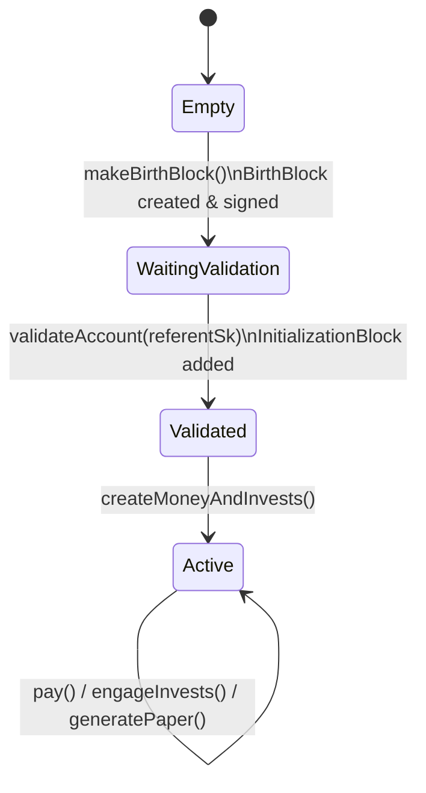
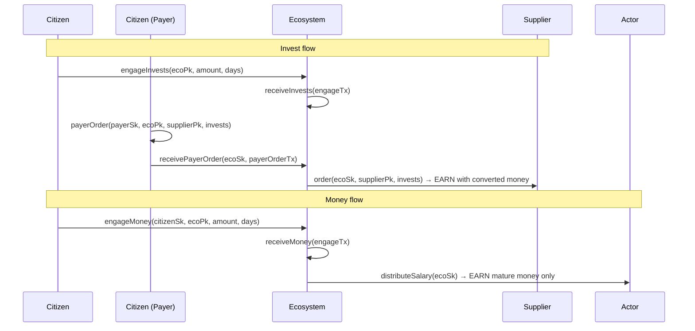
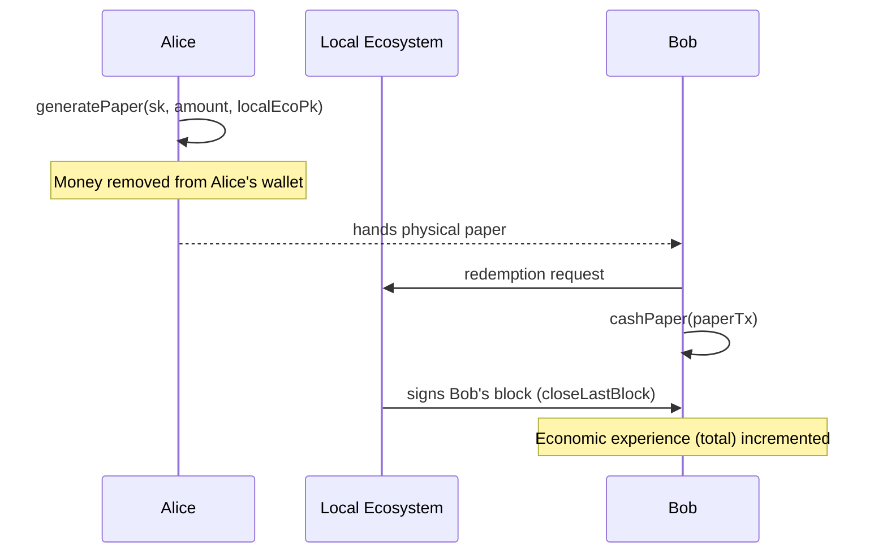

# organic-money.js

> The JavaScript implementation of the Organic Money cryptographic protocol

[](LICENSE)
[](https://www.npmjs.com/package/organic-money)
[](https://github.com/GuziEconomy/organic-money.js)

**organic-money.js** is the core cryptographic library of the [Organic Economy](https://economie-organique.fr) — a peer-to-peer monetary system where every citizen controls their own signed blockchain. Money creation grows naturally with each citizen's economic participation, and the protocol is fully compatible with both digital transactions and printed paper currency.

---

## Table of Contents

- [What is Organic Money?](#what-is-organic-money)
- [Project Ecosystem](#project-ecosystem)
- [Core Concepts](#core-concepts)
  - [Citizens and Blockchains](#citizens-and-blockchains)
  - [Money and Invests](#money-and-invests)
  - [The Level System](#the-level-system)
  - [Ecosystems](#ecosystems)
  - [Paper Money](#paper-money)
  - [Blocks and Transactions](#blocks-and-transactions)
- [Installation](#installation)
- [API Examples](#api-examples)
  - [Citizen Blockchain](#citizen-blockchain)
  - [Ecosystem Blockchain](#ecosystem-blockchain)
  - [Cryptographic Utilities](#cryptographic-utilities)
- [End-to-End Examples](#end-to-end-examples)
- [Transaction Types](#transaction-types)
- [Data Formats](#data-formats)
- [Development](#development)
- [License](#license)

---

## What is Organic Money?

Organic Money is a monetary system designed to grow alongside its users. Three principles guide it:

**Personal sovereignty** — every citizen holds their own blockchain. There is no central ledger. No third party can freeze, inflate, or manipulate a citizen's money.

**Organic growth** — money creation is tied to economic experience. The more a citizen participates and receives money from others, the more he can create each day. Growth follows a cubic progression that naturally balances early adopters and newcomers.

**Digital and paper parity** — every unit that exists digitally can also exist on paper. A citizen can convert digital money into a signed paper document, hand it to a neighbor, and the neighbor can later redeem it. The same cryptographic protocol governs both worlds.

---

## Project Ecosystem

Three projects compose the Organic Economy stack:

| Project | Role |
|---|---|
| **organic-money.js** ← you are here | Core protocol: blockchains, transactions, cryptography |
| [organic-server](https://github.com/GuziEconomy/organic-server) | HTTP server exposing the library as a REST API |
| [organic-webapp](https://github.com/GuziEconomy/organic-webapp) | Web application for citizens and ecosystems |

More information at [economie-organique.fr](https://economie-organique.fr).

### How the stack fits together



---

## Core Concepts

### Citizens and Blockchains

Each citizen owns a `CitizenBlockchain` — a chain of cryptographically signed blocks. A new account must be validated by any existing validated citizen (the **referent**) who signs the birth block.



### Money and Invests

Each citizen generates two types of units per day:

- **Money** — directly spendable currency. ID format: `YYYYMMDDXXX`
- **Invests** — commitment tokens pledged to ecosystems for collective projects. ID format: `YYYYMMDD9XXX`

```
20151106003   → 3rd money unit created on November 6, 2015
202511129004  → 4th invest unit created on November 12, 2025
```

The ID encodes both the creation date and type, making provenance trivially auditable. Because the date is embedded in the ID, a future invest ID (committed today for a date not yet reached) cannot be used in an order until that date arrives. Gaps from missed days are automatically filled when `createMoneyAndInvests` is next called.

When a citizen pays another, the money IDs are removed from the sender's wallet. The receiver records the transaction to increase their economic experience, which drives their level progression. A citizen's spendable balance (`block.money`) contains only money they have created themselves.

### The Level System

A citizen's **level** controls how many units they generate per day:

```
level = floor(∛economic_experience) + 1
```

**Economic experience** is the cumulative count of money units ever received by the citizen (via PAY and EARN transactions). It is stored as the `total` field in each block. This encourages economic participation and gives a natural catch-up mechanic: anyone can grow, but growth requires genuine exchange.

| Level | Units/day | Economic experience to reach |
|-------|-----------|------------------------------|
| 1     | 1         | 0 (starting level)           |
| 2     | 2         | 1                            |
| 3     | 3         | 8                            |
| 4     | 4         | 27                           |
| n     | n         | (n−1)³                       |

### Ecosystems

An `EcosystemBlockchain` represents a collective entity (cooperative, association, business). Citizen can have one or more of those three roles:

| Role | Description | Key field |
|------|-------------|-----------|
| **Admin** | Manages the ecosystem: assigns roles | — |
| **Actor** | Contributor who receives a proportional salary | `ratio` |
| **Payer** | Authorized to issue invest orders (optionally capped; `-1` = unlimited) | `cap` |

Two separate economic flows pass through an ecosystem:

- **Invest flow** — citizens engage invests into the ecosystem over a period of days. The engagement transaction carries invest IDs for the current day and all future days of the commitment; the ecosystem records them all at once (`receiveInvests`), but only invests whose date has been reached can be used in orders. A payer creates and signs an invest order on their own blockchain (`CitizenBlockchain.payerOrder`), then sends it to the ecosystem via `receivePayerOrder`. The ecosystem then executes the actual payment via `order`, which converts the mature invests into money (1 invest = 1 money, invest ID transformed to money ID by stripping the `9` separator) and sends them directly to the target as an EARN transaction — the target can be a citizen or another ecosystem.
- **Money flow** — citizens can engage money directly to an ecosystem (`engageMoney`), which the ecosystem receives via `receiveMoney`. All money (including future-dated units) is stored and only the mature portion is distributed to actors. The ecosystem distributes money to its actors proportionally via `distributeSalary`; only money whose date has been reached is distributed — future-dated money stays in the wallet until its date arrives.

The founding admin is automatically registered as admin and actor (ratio 1) when the ecosystem is created.



### Paper Money

A citizen can convert digital money into a **paper transaction** — a cryptographically signed document representing printed currency. The paper's `target` is the public key of the **local ecosystem** responsible for paper handling. When another citizen redeems the paper, their block must be signed by that same ecosystem.



### Blocks and Transactions

Each block is a sealed, signed snapshot of the blockchain state. When a transaction is added to an already-signed block, a new open block is created automatically. Blocks carry the current `money` and `invests` arrays forward. Active engagement transactions are automatically copied to the next block as long as their engagement period is still running.

The chain is immutable once closed: the next block's `previousHash` references the previous block's signature, forming the chain.

### Validating a blockchain

`blockchain.assertIsValid(depth = 0)` re-verifies a chain — useful after deserializing data from storage or the network, since it may have been tampered with. It throws an `InvalidBlockchainError` with a detailed message at the first check that fails. `depth = 0` checks the whole chain since genesis; `depth = N` checks only the N most recent blocks (faster, but can't validate things that depend on earlier history). `blockchain.isValid(depth)` is a convenience wrapper that returns `true`/`false` instead of throwing, for callers who only need a yes/no answer.

Generic checks (any `Blockchain`):
- each block's signature is cryptographically valid, and its merkle root matches its current transactions
- `previousHash` correctly chains to the previous block's signature
- only the most recent block may be unsigned (open)
- closedates are non-decreasing from oldest to newest
- the owner's public key never changes across blocks
- no transaction signature is replayed across blocks (role transactions are exempt — they're intentionally carried forward)
- if a block contains `PAPER` transactions, they all share the same target, and the block's signer is that target

`CitizenBlockchain` additionally replays each block's transactions to verify `CREATE` mints exactly the amount implied by the level of accumulated experience, that experience correctly reflects `PAY`/`EARN`/`PAPER` targeting the citizen, that it carries forward correctly between blocks, and that no two `CREATE` transactions across the chain reuse the same money/invest id.

`EcosystemBlockchain` additionally checks that the current state always has at least one admin and one actor with a ratio > 0, and (full history only) that replaying every role transaction reproduces the current admins/actors/payers exactly, with no `PAYERORDER` ever exceeding the payer cap in effect at the time, and that no `PAYERORDER` is exercised more than once (double-spend check via `EARN.x`).

---

## Installation

```bash
npm install organic-money
```

### Build for the browser

```bash
npm run build
# outputs: dist/organic-money.js
```

---

## API Examples

### Citizen Blockchain

#### Create a new citizen account

```js
import { CitizenBlockchain, randomPrivateKey, publicFromPrivate } from 'organic-money'

// The referent is any existing validated citizen who signs the new account
const referentSk = '...' // loaded from secure storage

const blockchain = new CitizenBlockchain()

// startBlockchain returns the new citizen's private key
const citizenSk = blockchain.startBlockchain(
  'Alice',
  new Date('1990-03-15'), // Alice's birth date
  referentSk              // referent validates the account
)
const citizenPk = publicFromPrivate(citizenSk)
// Store citizenSk securely — it signs every future transaction
```

The birth block is created and signed immediately, then the referent's InitializationBlock is added. The account is ready to use.

#### Create daily money and invests

```js
// Creates money for all days since the last creation, up to today
// The birth block already creates the first day's money;
// subsequent calls fill any gaps automatically.
blockchain.createMoneyAndInvests(citizenSk)

// Or specify a past date:
blockchain.createMoneyAndInvests(citizenSk, new Date('2024-06-14'))
```

#### Check balance and progression

```js
blockchain.getLevel()                     // current level, e.g. 2
blockchain.getAvailableMoneyAmount()      // count of spendable money units
blockchain.getMoneyBeforeNextLevel()      // units to receive before next level
blockchain.getMoneyBeforeNextLevel(true)  // same, as percentage (0–100)
blockchain.hasLevelUpOnLastTx()           // true if last PAY, EARN or PAPER triggered a level-up
```

#### Pay another citizen

```js
const bobPk = '...'

// Creates and signs the payment; removes money from Alice's wallet
const payTx = blockchain.pay(citizenSk, bobPk, 5)

// Bob records the transaction on his blockchain
// (increases Bob's economic experience / total)
bobBlockchain.receivePay(payTx)
```

#### Engage invests into an ecosystem

```js
const ecoPk = '...'

// Commit 2 invests/day for 30 consecutive days to the ecosystem
const engageTx = blockchain.engageInvests(citizenSk, ecoPk, 2, 30)

// The ecosystem records the commitment
ecoBlockchain.receiveInvests(engageTx)
```

#### Engage money (recurring commitment)

```js
// Commit 1 money/day for 7 days (e.g. for a subscription service)
const engageTx = blockchain.engageMoney(citizenSk, targetPk, 1, 7)
```

#### Generate paper money

```js
const localEcoPk = '...' // public key of the local ecosystem handling papers

// Convert 10 digital money units into a paper certificate
const paperTx = blockchain.generatePaper(citizenSk, 10, localEcoPk)
// Money is removed from the wallet; paperTx can be printed/transmitted physically
```

#### Cash a paper

```js
// The block containing this transaction must be signed by the local ecosystem
blockchain.cashPaper(paperTx)
```

#### Close a block and persist

```js
// Seal the current block with a date and signature
blockchain.closeLastBlock(citizenSk)

// Serialize for storage (returns a plain JS array)
const data = blockchain.export()

// Restore from storage
const restored = new CitizenBlockchain(data)
```

---

### Ecosystem Blockchain

#### Create an ecosystem

```js
import { EcosystemBlockchain, randomPrivateKey, publicFromPrivate } from 'organic-money'

// Admin should be a citizen, here we use random for example
const adminSk = randomPrivateKey()
const adminPk = publicFromPrivate(adminSk)

const eco = new EcosystemBlockchain()

// adminSk validates the ecosystem (like a referent)
// adminPk becomes the first admin and actor (ratio 1) automatically
const ecoSk = eco.startBlockchain('Local Coop', adminSk, adminPk)
const ecoPk = publicFromPrivate(ecoSk)
```

#### Manage roles

Role transactions (`SetAdmin`, `SetActor`, `SetPayer` and their `unset` counterparts) are created on the **admin's own blockchain** — mirroring `payerOrder`/`receivePayerOrder` — then sent to the ecosystem, which validates the signer is one of its admins before recording it. This binds each transaction to one specific ecosystem (the `ecosystem` field), so it can't be replayed onto another ecosystem the same admin happens to manage.

```js
// adminBc is the CitizenBlockchain of the admin (adminSk / adminPk)

// Add actors (receive salaries proportional to their ratio)
const aliceActorTx = adminBc.setActor(adminSk, ecoPk, alicePk, 2)   // Alice: ratio 2
eco.receiveSetActor(aliceActorTx)

const bobActorTx = adminBc.setActor(adminSk, ecoPk, bobPk, 1)       // Bob: ratio 1
eco.receiveSetActor(bobActorTx)

// Add a payer (can issue invest orders; -1 = unlimited)
const payerTx = adminBc.setPayer(adminSk, ecoPk, alicePk, -1)
eco.receiveSetPayer(payerTx)

// Add another admin
const newAdminTx = adminBc.setAdmin(adminSk, ecoPk, charliePk)
eco.receiveSetAdmin(newAdminTx)

// Remove roles
const unsetActorTx = adminBc.unsetActor(adminSk, ecoPk, bobPk)
eco.receiveUnsetActor(unsetActorTx)

const unsetPayerTx = adminBc.unsetPayer(adminSk, ecoPk, alicePk)
eco.receiveUnsetPayer(unsetPayerTx)

const unsetAdminTx = adminBc.unsetAdmin(adminSk, ecoPk, charliePk)  // at least one admin must always remain
eco.receiveUnsetAdmin(unsetAdminTx)
```

#### Query roles

```js
eco.getAdmins()       // Set<publicKey>
eco.getActors()       // Map<publicKey, ratio>
eco.getPayers()       // Map<publicKey, cap>

eco.isAdmin(alicePk)  // boolean
eco.isActor(alicePk)  // boolean
eco.isPayer(alicePk)  // boolean
```

#### Query available invests

```js
// Count invests whose date has been reached (usable in orders today)
eco.getAffordableInvestsAmount()

// Count invests that will be mature by a future date
eco.getAffordableInvestsAmount(new Date('2025-03-01'))
```

#### Receive citizen investments

```js
// The citizen engages invests targeting the ecosystem
const engageTx = citizenBlockchain.engageInvests(citizenSk, ecoPk, 2, 30)

// The ecosystem records the commitment and adds invests to its wallet
eco.receiveInvests(engageTx)

console.log(eco.invests.length) // invests now available in the ecosystem
```

#### Receive citizen money engagements

```js
// A citizen engages money directly to the ecosystem (e.g. for a purchase or subscription)
const engageTx = citizenBlockchain.engageMoney(citizenSk, ecoPk, 1, 30)

// The ecosystem records the commitment and adds all money IDs (including future-dated) to its wallet
eco.receiveMoney(engageTx)
```

#### Issue invest orders

```js
// Alice (payer) creates and signs the order on her own blockchain
const payerOrderTx = aliceBlockchain.payerOrder(aliceSk, ecoPk, supplierPk, eco.invests.slice(0, 5))

// Alice sends the signed order to the ecosystem; it validates and records it
eco.receivePayerOrder(ecoSk, payerOrderTx)

// The ecosystem executes the order: invests are converted to money (invest ID → money ID, 1:1)
// and sent to the target (citizen or ecosystem) as an EARN transaction
const earnTx = eco.order(ecoSk, supplierPk, eco.invests.slice(0, 3))

// The target records the earn transaction on their own blockchain
supplierBlockchain.receiveEarn(earnTx)
```

#### Distribute earnings to actors

```js
// Distribute mature money in the ecosystem's wallet, proportional to actor ratios
// Only money whose date has been reached is distributed — future-dated money stays in the wallet
// adminPk (ratio 1) and alicePk (ratio 2): alicePk gets twice as much
const earns = eco.distributeSalary(ecoSk)

// Each earn transaction is then added to the corresponding actor's blockchain
for (const earnTx of earns) {
  const actorBlockchain = getBlockchainFor(earnTx.target)
  actorBlockchain.receiveEarn(earnTx)
}

// Or target a single actor:
eco.earn(ecoSk, actorPk, moneyIds)
```

---

### Cryptographic Utilities

```js
import {
  randomPrivateKey,
  publicFromPrivate,
  dateToInt,
  intToDate,
  signHash,
  verifySignature,
  hashTimestampAuth,
  aesEncrypt,
  aesDecrypt
} from 'organic-money'

// Key pair generation (SECP256K1)
const sk = randomPrivateKey()       // 32-byte hex private key
const pk = publicFromPrivate(sk)    // 33-byte compressed hex public key

// Date helpers (dates are stored as YYYYMMDD integers internally)
const d  = dateToInt(new Date())    // → e.g. 20240614
const dt = intToDate(20240614)      // → Date object

// Sign and verify
const hash = new Uint8Array(32)
const sig  = signHash(hash, sk)
const ok   = verifySignature(hash, sig, pk)

// Authentication token (used by organic-server for session validation)
const token = hashTimestampAuth(pk, Date.now())

// Encrypt a private key for local storage (AES + Scrypt key derivation)
const encrypted = await aesEncrypt(sk, 'user-passphrase')
const decrypted  = await aesDecrypt(encrypted, 'user-passphrase')
```

---

## End-to-End Examples

### Complete citizen lifecycle

This example shows the full journey from account creation to payment and paper money.

```js
import { CitizenBlockchain, randomPrivateKey, publicFromPrivate } from 'organic-money'

// ── 1. Referent: any existing validated citizen ───────────────────────────────
// In production this is an existing account; here we create a self-signed one
const referentSk = randomPrivateKey()
const referent = new CitizenBlockchain()
referent.startBlockchain('Referent', new Date('1980-01-01'), referentSk)

// ── 2. Alice creates her birth block (on her own device) ─────────────────────
const yesterday = new Date(Date.now() - 86400000)

const alice = new CitizenBlockchain()
const aliceSk = alice.makeBirthBlock('Alice', new Date('1990-03-15'), null, yesterday)
const alicePk = publicFromPrivate(aliceSk)
// Alice sends her birth block to the referent for validation

// ── 2b. The referent validates Alice's account ────────────────────────────────
alice.validateAccount(referentSk, yesterday)
// The referent's InitializationBlock is added; the account is now active

console.log(alice.isValidated())          // true
console.log(alice.getLevel())             // 1 — starts at level 1
// The birth block already created 1 money + 1 invest for yesterday

// ── 3. The next day: Alice creates today's money ──────────────────────────────
alice.createMoneyAndInvests(aliceSk)
// Now Alice has 2 money units and 2 invest units (1 from birth + 1 from today)
console.log(alice.getAvailableMoneyAmount())  // 2

// ── 4. Bob does the same ──────────────────────────────────────────────────────
const bob = new CitizenBlockchain()
const bobSk = bob.startBlockchain('Bob', new Date('1992-07-22'), referentSk, null, yesterday)
const bobPk = publicFromPrivate(bobSk)
bob.createMoneyAndInvests(bobSk)

// ── 5. Bob pays Alice 1 unit ──────────────────────────────────────────────────
const payTx = bob.pay(bobSk, alicePk, 1)
alice.receivePay(payTx)
// Alice's economic experience (total) increases → she is growing toward level 2

console.log(alice.getMoneyBeforeNextLevel())  // 0 units received until level 2 (needs 1, has 1)
console.log(alice.hasLevelUpOnLastTx())       // true! Alice just reached level 2

// ── 6. Alice generates paper money ───────────────────────────────────────────
const localEcoPk = publicFromPrivate(randomPrivateKey()) // the local ecosystem managing papers
const paperTx = alice.generatePaper(aliceSk, 1, localEcoPk)
// One money unit converted to paper; removed from Alice's digital wallet

// ── 7. Persist: close blocks and serialize ────────────────────────────────────
alice.closeLastBlock(aliceSk)
bob.closeLastBlock(bobSk)

const aliceData = alice.export()
const aliceRestored = new CitizenBlockchain(aliceData)
console.log(aliceRestored.getLevel())     // 2 — state preserved
```

---

### Complete ecosystem lifecycle

This example shows how citizens invest into an ecosystem and how roles are managed.

```js
import { CitizenBlockchain, EcosystemBlockchain, randomPrivateKey, publicFromPrivate } from 'organic-money'

const referentSk = randomPrivateKey()
const referent = new CitizenBlockchain()
referent.startBlockchain('Referent', new Date('1980-01-01'), referentSk)

const yesterday = new Date(Date.now() - 86400000)

// ── 1. Two citizens accumulate invests ────────────────────────────────────────
const alice = new CitizenBlockchain()
const aliceSk = alice.startBlockchain('Alice', new Date('1990-01-01'), referentSk, null, yesterday)
const alicePk = publicFromPrivate(aliceSk)
alice.createMoneyAndInvests(aliceSk)

const bob = new CitizenBlockchain()
const bobSk = bob.startBlockchain('Bob', new Date('1992-01-01'), referentSk, null, yesterday)
const bobPk = publicFromPrivate(bobSk)
bob.createMoneyAndInvests(bobSk)

// ── 2. Create the ecosystem ───────────────────────────────────────────────────
// Alice is both the validator and the first admin
const eco = new EcosystemBlockchain()
const ecoSk = eco.startBlockchain('Local Coop', aliceSk, alicePk)
const ecoPk = publicFromPrivate(ecoSk)

// Alice is auto-registered as admin + actor (ratio 1) at creation
console.log(eco.isAdmin(alicePk))   // true
console.log(eco.isActor(alicePk))   // true (ratio 1)

// Add Bob as an actor with equal ratio
const bobActorTx = alice.setActor(aliceSk, ecoPk, bobPk, 1)
eco.receiveSetActor(bobActorTx)

// Alice becomes a payer (can issue invest orders, unlimited)
const alicePayerTx = alice.setPayer(aliceSk, ecoPk, alicePk, -1)
eco.receiveSetPayer(alicePayerTx)

// ── 3. Both citizens engage invests into the ecosystem ────────────────────────
const aliceEngageTx = alice.engageInvests(aliceSk, ecoPk, 1, 30)
eco.receiveInvests(aliceEngageTx)

const bobEngageTx = bob.engageInvests(bobSk, ecoPk, 1, 30)
eco.receiveInvests(bobEngageTx)

console.log(eco.invests.length)  // 60 (30 from Alice + 30 from Bob)

// ── 4. Alice (payer) issues an invest order to a supplier ─────────────────────
const supplierPk = publicFromPrivate(randomPrivateKey())

// Alice signs the order on her own blockchain and sends it to the ecosystem
const payerOrderTx = alice.payerOrder(aliceSk, ecoPk, supplierPk, eco.invests.slice(0, 10))
eco.receivePayerOrder(ecoSk, payerOrderTx)

console.log(eco.invests.length)  // 60 (invests stay until order() removes them)

// ── 5. The ecosystem finalizes an order (removes invests from its wallet) ─────
eco.order(ecoSk, supplierPk, eco.invests.slice(0, 5))
console.log(eco.invests.length)  // 55

// ── 6. The ecosystem distributes earnings to actors ───────────────────────────
// (assuming money is available in the ecosystem's wallet)
// Alice (ratio 1) and Bob (ratio 1) each receive 50% of the distributed amount
const earns = eco.distributeSalary(ecoSk)

for (const earnTx of earns) {
  if (earnTx.target === alicePk) alice.receiveEarn(earnTx)
  if (earnTx.target === bobPk)   bob.receiveEarn(earnTx)
}

// ── 7. Persist ────────────────────────────────────────────────────────────────
eco.closeLastBlock(ecoSk)
const ecoData = eco.export()
const ecoRestored = new EcosystemBlockchain(ecoData)
console.log(ecoRestored.isAdmin(alicePk))  // true — roles preserved
```

---

## Transaction Types

| # | Type | Description | Key fields |
|---|------|-------------|------------|
| 1 | `INIT` | Citizen or ecosystem initialization | `name`, `birthdate` |
| 2 | `CREATE` | Daily money & invest generation | `money[]`, `invests[]` |
| 3 | `PAY` | Transfer money to another citizen | `money[]`, `target` |
| 4 | `ENGAGE` | Commit money or invests for N days | `money[]` or `invests[]`, `target` |
| 5 | `PAPER` | Convert digital money into a paper certificate | `money[]`, `target` (local eco public key) |
| 6 | `SETADMIN` | Assign an ecosystem admin (signed by another admin on their blockchain) | `target`, `e` (ecosystem pk) |
| 7 | `SETACTOR` | Assign an ecosystem actor | `target`, `ratio`, `e` (ecosystem pk) |
| 8 | `SETPAYER` | Assign an ecosystem payer (`cap=-1` = unlimited, `cap=0` = exhausted, `cap>0` = limited) | `target`, `cap`, `e` (ecosystem pk) |
| 9 | `UNSETADMIN` | Remove an ecosystem admin | `target`, `e` (ecosystem pk) |
| 10 | `UNSETACTOR` | Remove an ecosystem actor | `target`, `e` (ecosystem pk) |
| 11 | `UNSETPAYER` | Remove an ecosystem payer | `target`, `e` (ecosystem pk) |
| 12 | `PAYERORDER` | Payer issues an invest order (signed by payer on their blockchain) | `invests[]`, `target`, `e` (ecosystem pk) |
| 13 | `EARN` | Distribute earnings to an actor or supplier | `money[]`, `target`, `x` (PayerOrder signature — present only when triggered by `order()`, prevents double-spend) |

### Transaction exchange methods

Every transaction is created on one blockchain and received on another, mirroring how data moves between two independent parties. `SETADMIN`, `SETACTOR`, `SETPAYER` and their `unset` counterparts carry an `e` (ecosystem) field so a role transaction signed for one ecosystem can't be replayed onto another the same admin happens to manage — the same protection `PAYERORDER` already had.

| Type | Created by | Received by |
|------|-----------|-------------|
| `PAY` | `CitizenBlockchain.pay` | `CitizenBlockchain.receivePay` and `EcosystemBlockchain.receivePay` |
| `ENGAGE` (invests) | `CitizenBlockchain.engageInvests` | `EcosystemBlockchain.receiveInvests` |
| `ENGAGE` (money) | `CitizenBlockchain.engageMoney` | `EcosystemBlockchain.receiveMoney` |
| `PAPER` | `CitizenBlockchain.generatePaper` | `CitizenBlockchain.cashPaper` and `EcosystemBlockchain.cashPaper` |
| `PAYERORDER` | `CitizenBlockchain.payerOrder` | `EcosystemBlockchain.receivePayerOrder` |
| `EARN` | `EcosystemBlockchain.earn` / `order` / `distributeSalary` | `CitizenBlockchain.receiveEarn` and `EcosystemBlockchain.receiveEarn` |
| `SETADMIN` | `CitizenBlockchain.setAdmin` | `EcosystemBlockchain.receiveSetAdmin` |
| `UNSETADMIN` | `CitizenBlockchain.unsetAdmin` | `EcosystemBlockchain.receiveUnsetAdmin` |
| `SETACTOR` | `CitizenBlockchain.setActor` | `EcosystemBlockchain.receiveSetActor` |
| `UNSETACTOR` | `CitizenBlockchain.unsetActor` | `EcosystemBlockchain.receiveUnsetActor` |
| `SETPAYER` | `CitizenBlockchain.setPayer` | `EcosystemBlockchain.receiveSetPayer` |
| `UNSETPAYER` | `CitizenBlockchain.unsetPayer` | `EcosystemBlockchain.receiveUnsetPayer` |

`INIT` and `CREATE` never leave their own blockchain: `INIT` is built directly inside `BirthBlock`/`EcoBirthBlock` at genesis, and `CREATE` is a citizen's own daily money generation — neither is ever sent anywhere.

---

## Data Formats

### Transaction wire format

Every transaction is serialized with short field names for compactness:

```json
{
  "v": 1,
  "d": 20240614,
  "t": 3,
  "p": "<target public key — 33-byte compressed hex>",
  "s": "<signer public key — 33-byte compressed hex>",
  "m": [20240614000, 20240614001],
  "i": [],
  "h": "<DER-encoded SECP256K1 signature (hex)>"
}
```

| Field | Long name | Description |
|-------|-----------|-------------|
| `v` | version | Protocol version (always `1`) |
| `d` | date | Transaction date as `YYYYMMDD` integer |
| `t` | type | Transaction type (1–14) |
| `p` | target | Recipient's compressed public key |
| `s` | signer | Sender's compressed public key |
| `m` | money | Array of money unit IDs |
| `i` | invests | Array of invest unit IDs |
| `h` | signature | DER-encoded SECP256K1 signature of the transaction hash |

### Block wire format

```json
{
  "v": 1,
  "d": 20240614,
  "p": "<previous block signature (hex)>",
  "s": "<signer public key (hex)>",
  "m": [20240614000],
  "i": [202406149000],
  "t": 42,
  "r": "<merkle root of transaction signatures (hex)>",
  "h": "<block signature (hex)>",
  "x": []
}
```

| Field | Long name | Description |
|-------|-----------|-------------|
| `v` | version | Protocol version |
| `d` | closedate | Date the block was sealed (`YYYYMMDD`) |
| `p` | previousHash | Signature of the previous block (chain link) |
| `s` | signer | Block signer's compressed public key |
| `m` | money | Available (unspent) money unit IDs at seal time |
| `i` | invests | Available invest unit IDs at seal time |
| `t` | total | Economic experience (cumulative money received) — drives level progression |
| `r` | merkleroot | Merkle root of all transaction signatures in the block |
| `h` | signature | DER-encoded SECP256K1 signature of the block |
| `x` | transactions | Array of all transactions in the block |

### Money and Invest ID format

```
Money ID:   YYYYMMDDXXX       example: 20151106003
Invest ID:  YYYYMMDD9XXX      example: 202511129004
```

The `9` separator distinguishes invest IDs from money IDs at a glance. Both IDs embed their creation date, making provenance and validity verifiable without external lookups.

### Special block hashes

| Constant | Value | Role |
|----------|-------|------|
| `REF_HASH` | `c1a551ca...` | `previousHash` of a citizen `BirthBlock` |
| `ECOREF_HASH` | `ec051c1a...` | `previousHash` of an ecosystem `EcoBirthBlock` |

These sentinel values allow any deserializer to identify the genesis block of a chain without additional metadata.

---

## Development

```bash
# Install dependencies
npm install

# Run the full test suite (Mocha + Chai)
npm test

# Build browser bundle
npm run build       # outputs dist/organic-money.js

# Watch mode (rebuild on file change)
npm run watch
```

### Test coverage

| File | What it covers |
|------|----------------|
| `Block.test.js` | Block creation, signing, Merkle trees, paper handling |
| `Blockchain.test.js` | Transaction lifecycle, block sealing, state propagation |
| `CitizenBlockchain.test.js` | Money creation, payments, engagements, paper money, level system |
| `EcosystemBlockchain.test.js` | Role management, invest orders, salary distribution |
| `Transaction.test.js` | All 13 transaction types, serialization, validation |
| `crypto.test.js` | SECP256K1 signing, AES encryption, date utilities |

---

## License

[MIT](LICENSE) — © suipotryot
